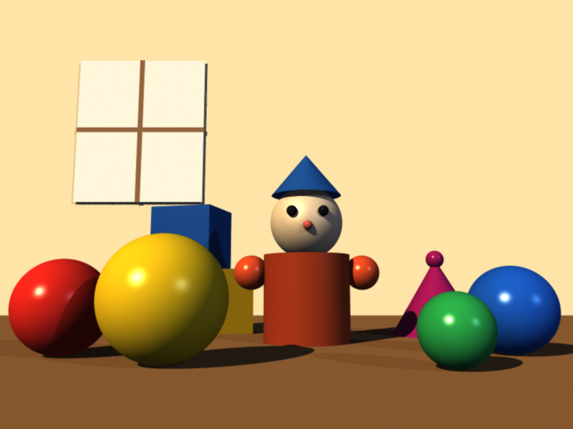
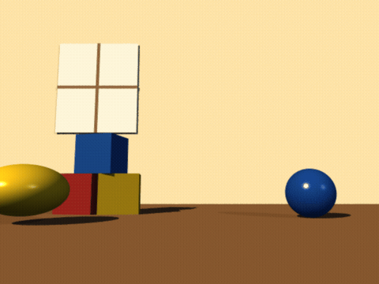
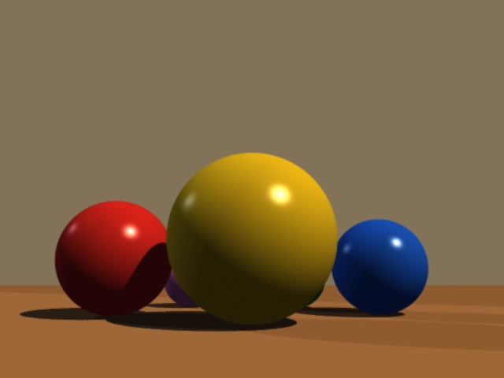
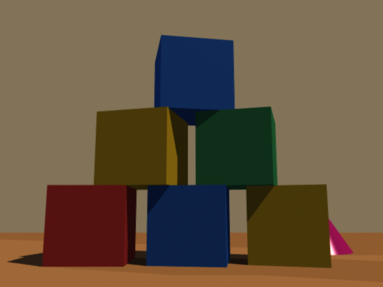
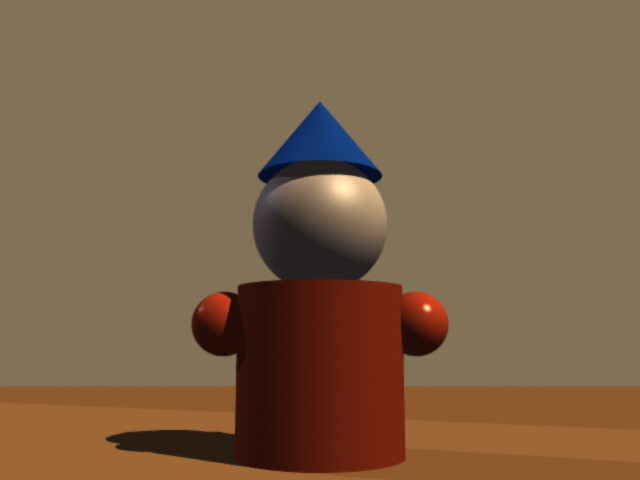
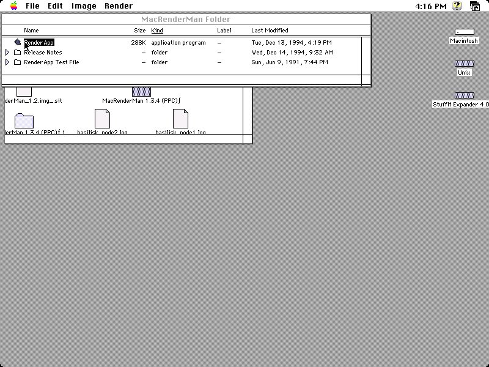
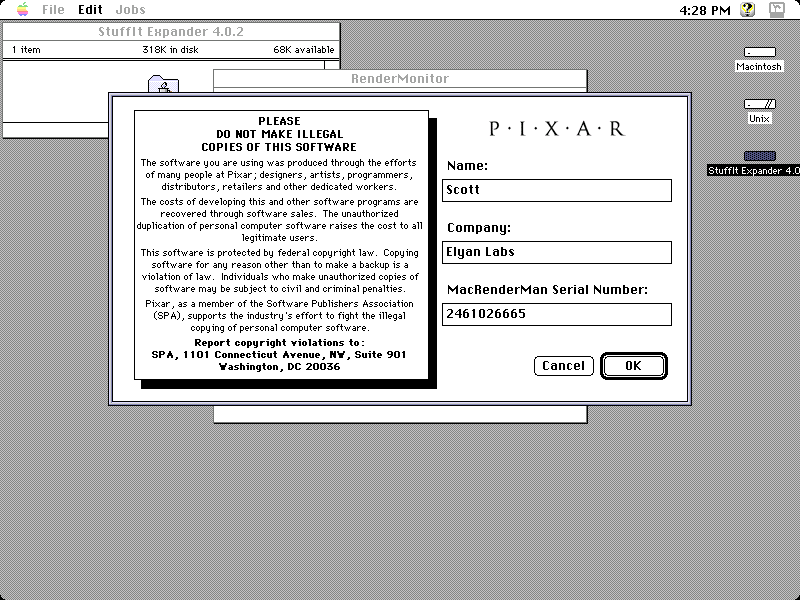
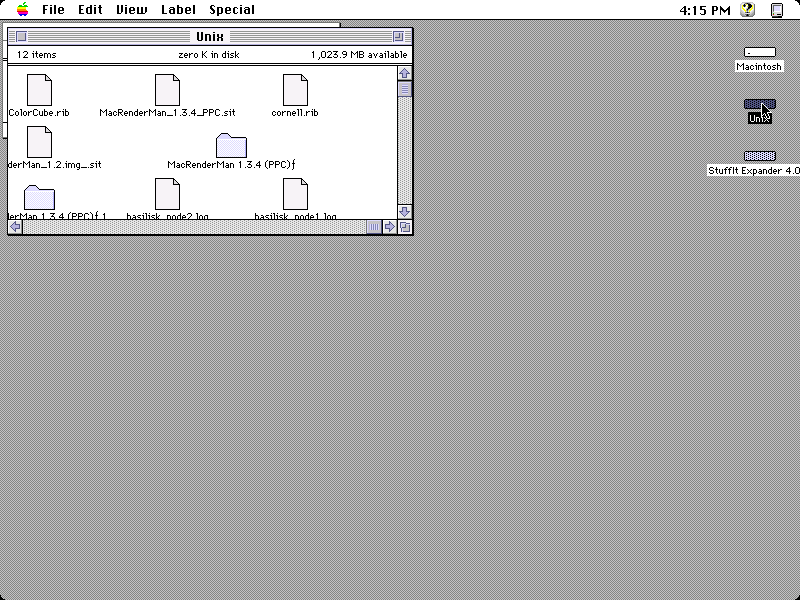
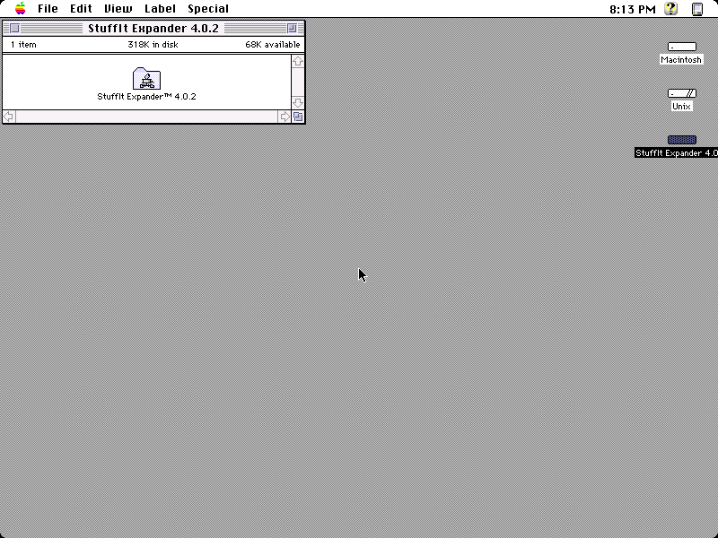

# Cathode Farm

A 1994-style AppleTalk render farm built from emulated Macintoshes in Docker.

Each container runs one emulated Mac (System 7.5) on a patched build of Basilisk II.
The nodes share one virtual EtherTalk segment over Basilisk's UDP tunnel, so they can
see each other on AppleTalk the way a room full of Quadras did in 1994. Every node is
driven from the host over a control socket, so the whole thing is scriptable.

This started as a question about how Toy Story was rendered and turned into a working
cluster of vintage Macs you can spin up with one command.

## What rendered these images (read this first)

To be clear about what did the work: **every rendered image below was produced by
BMRT (Blue Moon Rendering Tools), the free, open-source, RenderMan-compliant renderer. No license, no
serial.** BMRT reads the same RIB scene-description spec that Pixar defined.

Pixar's own **MacRenderMan** is installed and launches inside the emulated Mac (the
screenshots prove that), but it **never actually rendered a frame here.** It stops at
Pixar's serial-number gate, which shipped with the 1994 software and which we did not
have and did not crack. So: MacRenderMan *runs*, BMRT *renders*.

## Gallery

A composed Toy Story-flavored scene, rendered with BMRT in 38 seconds:



And it moves. A Luxo-style bouncing ball with squash-and-stretch, 54 frames rendered
with BMRT across 16 cores in 30 seconds, stitched to video:



([full-quality mp4](renders/the_bounce.mp4))

Three quick scenes (bouncing balls, block tower, peg toy), rendered with BMRT, ~8 seconds each:





Pixar's genuine MacRenderMan 1.3.4 installed and **launching** inside an emulated Mac,
driven entirely from the host over the ADB control socket. It runs, but note it did not
render any of the frames above:



The reason it produced no frames: Pixar's serial-number gate, exactly as it shipped in
1994. We entered nothing valid and did not bypass it:



The host-to-Mac bridge, with RIB files staged and MacRenderMan expanded on the emulated desktop:



A farm node booted to System 7.5 inside its container:



## What is in here

- `patches/basilisk-adb-control-server.patch` - the one real code change. It adds a small
  TCP control server to Basilisk II that injects mouse and keyboard events directly at the
  ADB layer with precise timing. Host-side automation of the classic Mac Finder through X11
  is unreliable (double-clicks and focus never behave); injecting at the ADB layer is exact.
- `docker/` - a multi-stage image that compiles the patched emulator inside the container
  (so it matches the runtime glibc), plus the entrypoint, compose file, and init script.
- `macctl.sh` - drive a node from the host: click, double-click, type, key, screenshot.
- `launch_node.sh` - run a single node directly on the host (no Docker).
- `farm_dashboard.html` - a self-contained status page for the running farm.

## The control protocol

Line-based, over TCP. Default port 6560 inside a node.

```
m X Y     move mouse (absolute)      d / u     left button down / up
c X Y     click                      dc X Y    double-click (Mac-timed)
k CODE    key press                  kd / ku   key down / up
cmd CODE  Command + key              t TEXT    type an ASCII string
```

Mac key codes: Return 36, Command 55, Shift 56, O 31, W 13.

## Running the farm

You supply three things the license does not let this repo ship: a Macintosh ROM
(a Quadra/Performa 630 ROM works), a bootable System 7.5 disk image, and StuffIt
Expander. Place them under `docker/assets/` as `mac.rom`, `os_base.img`, and
`stuffit.img`, then:

```sh
cd docker
./farm-init.sh              # give each node its own writable OS copy
docker compose up -d        # boots RenderNode-Alpha, -Bravo, -Charlie
```

Drive any node from the host (ports 6561/6562/6563 map to the three Macs):

```sh
printf 'dc 762 104\n' | nc 127.0.0.1 6561      # double-click on Alpha
```

## Why the container needs extra privileges

Basilisk runs a realtime 60Hz timer thread and wants raw Ethernet, so each node needs
`SYS_NICE` and `NET_ADMIN` plus an `rtprio` ulimit. Those are set in the compose file.
Without them the emulator cannot create its timer thread and the Mac never boots.

## Building the patched emulator by hand

```sh
git clone https://github.com/kanjitalk755/macemu
cd macemu && git apply /path/to/patches/basilisk-adb-control-server.patch
cd BasiliskII/src/Unix
NO_CONFIGURE=1 ./autogen.sh
./configure --enable-sdl-video --enable-sdl-audio --disable-vosf --without-gtk --without-mon
make -j"$(nproc)"
```

## Credits and license

Basilisk II is by Christian Bauer and contributors, GPL-2.0. The patch here is a
derivative work under the same license. Everything original in this repo (the Docker
system, scripts, dashboard) is provided under GPL-2.0 to match.

Built at Elyan Labs as part of the RenderMan Time Machine project.

## MCP control

The farm is also exposed as MCP tools (screenshot + reliable input) so an
assistant can drive the Macs directly. See [mcp/](mcp/).
