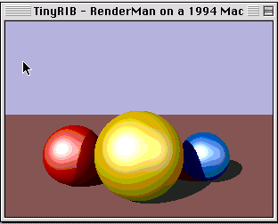

# TinyRIB

A tiny RenderMan-compliant raytracer, written in C and cross-compiled with
[Retro68](https://github.com/autc04/Retro68) to a **native 68K Macintosh application**.
It reads a subset of RIB (Format, Projection, LightSource, Surface, Color, Sphere,
Polygon, transforms), ray-traces the scene with matte/plastic shading and ray-traced
shadows, and draws to a Mac window as it renders.

This is how the RenderMan Time Machine renders *on the emulated 1994 Mac itself* without
Pixar's serial-locked MacRenderMan and without cracking anything: we wrote the renderer.



## Build

```sh
mkdir build && cd build
cmake .. -DCMAKE_TOOLCHAIN_FILE=~/Retro68/build/toolchain/m68k-apple-macos/cmake/retro68.toolchain.cmake
make          # produces TinyRIB.APPL and TinyRIB.dsk (an 800K mountable disk)
```

Drop `toy.rib` on the disk next to the app, mount it in Basilisk II, and double-click
TinyRIB. It renders `toy.rib` on the emulated 68040. GPL-2.0, (c) Elyan Labs.

The camera is read straight from the RIB: the pre-`WorldBegin` transform is inverted
(Gauss-Jordan) to place the eye and look direction, and the field of view comes from
`Projection "perspective" "fov"`. RenderMan's left-handed convention is handled (rotations
negated into our right-handed matrices; +x maps to screen-right).
