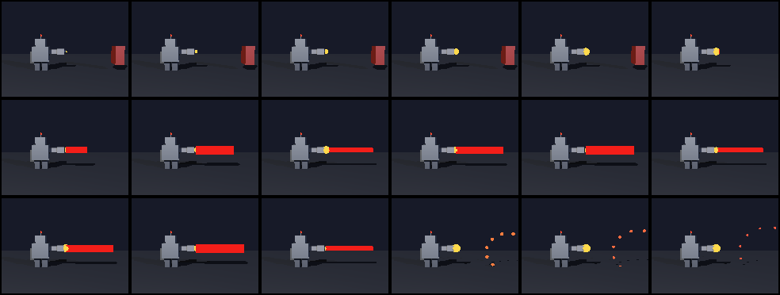

# TinyRIB

A tiny RenderMan-compliant raytracer, written in C and cross-compiled with
[Retro68](https://github.com/autc04/Retro68) to a **native 68K Macintosh application**.
It reads a subset of RIB (Format, Projection, LightSource, Surface, Color, Sphere,
Polygon, transforms), ray-traces the scene with matte/plastic shading and ray-traced
shadows, and draws to a Mac window as it renders.

This is how the RenderMan Time Machine renders *on the emulated 1994 Mac itself* without
Pixar's serial-locked MacRenderMan and without cracking anything: we wrote the renderer.


## Build

```sh
mkdir build && cd build
cmake .. -DCMAKE_TOOLCHAIN_FILE=~/Retro68/build/toolchain/m68k-apple-macos/cmake/retro68.toolchain.cmake
make          # produces TinyRIB.APPL and TinyRIB.dsk (an 800K mountable disk)
```

Drop `toy.rib` on the disk next to the app, mount it in Basilisk II, and double-click
TinyRIB. It renders `toy.rib` on the emulated 68040. GPL-2.0, (c) Elyan Labs.

The camera is read straight from the RIB: the pre-`WorldBegin` transform is inverted
(Gauss-Jordan) to place the eye and look direction, and the field of view comes from
`Projection "perspective" "fov"`. RenderMan's left-handed convention is handled (rotations
negated into our right-handed matrices; +x maps to screen-right).

## Animation + the render farm

TinyRIB also renders sequences. If files named `frameNN.rib` are present on its
volume it enters **batch mode**: it renders each to `frameNN.ppm` (a real image file
written to disk), writes a `DONE` marker, and quits. Any subset works, so different
farm nodes render different frames.

`gen_robot_laser.py` emits an 18-frame "robot shooting a laser" animation (boxes +
spheres + a `constant`/emissive laser beam). We split it across **three emulated Macs**
running in parallel - each its own Basilisk II instance and OS image (`farm/farmA..C.prefs`,
launched with `farm/launch_farm.sh`), rendering 6 frames each. After a clean shutdown
flushes the disks, `farm/collect_and_assemble.sh` pulls the 18 PPMs off the HFS images
with `hcopy` and assembles the GIF.



The result ([renders/robot_laser.gif](../renders/robot_laser.gif)) was rendered entirely on
the emulated 68040s - about 3 minutes per frame, authentically slow, the way 1994 was.

### Host preview build

The renderer is portable C; only pixel output and the window are Mac-specific. Compile
the same source with `-DHOST_PREVIEW` to get a Linux binary that reads a RIB and writes a
PPM, for fast iteration on scenes before rendering them for real on the Macs:

```sh
cc -DHOST_PREVIEW -O2 -o tinyrib_host tinyrib.c -lm
./tinyrib_host frame00.rib frame00.ppm
```

Because it is the same source, the preview is pixel-faithful to what the Macs produce.
